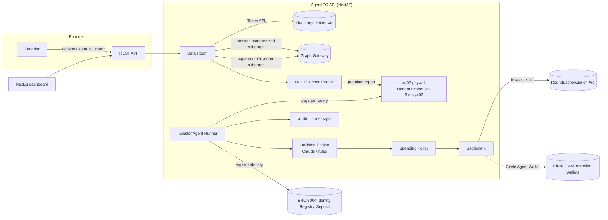

# AgentIPO — Architecture

> Open-data startup fundraising where the investor is an AI agent bound by a human mandate.
> Founders publish a verifiable data room. Agents buy due-diligence data per query (x402 on Hedera),
> reason over live on-chain signals (The Graph), and settle USDC into a milestone escrow (Arc).

## 1. System overview



## 2. Sponsor track mapping

| Track | What in the code satisfies it |
| --- | --- |
| The Graph — AI use case (from scratch) | Agents cannot decide without Graph data: `data-room` providers pull live Token API + subgraph data, the `due-diligence` engine turns it into findings, the `agents` decision engine reasons over it. |
| The Graph — composable / standardized | Three Graph products composed: **Token API** (holders, transfers, balances), **Messari standardized DEX schema** (liquidity/volume across any DEX with one query), **Agent0 ERC-8004 subgraph** (identity + reputation). |
| Hedera — AI & agentic payments | `GET /due-diligence/rounds/:id/premium` is x402-gated; settlement through Blocky402 facilitator on Hedera testnet. Agents pay per request with USDC/HBAR. Decisions are written to an HCS topic (bonus). ERC-8004 identity (bonus). |
| Arc — agentic economy w/ Circle Agent Stack | Agents hold wallets (local key or Circle developer-controlled wallet on `ARC-TESTNET`), decide from real signals, enforce spending policy, settle USDC into `RoundEscrow`. |
| Arc — DeFi / programmable money | `RoundEscrow.sol`: conditional USDC flows — target-or-refund, milestone-based release to the founder. |

## 3. Monorepo layout

```
apps/api            NestJS 11 — the platform (modules below)
apps/web            Next.js 16 dashboard (server components, reads the API)
packages/shared     zod schemas + chain constants shared by api & web
packages/contracts  Foundry — RoundEscrow.sol + tests + deploy script (Arc testnet)
```

## 4. API module structure (ports & adapters)

Every module follows the same four folders. Domain never imports Nest or Prisma.

```
modules/<name>/
  domain/          entities, value objects, ports (interfaces) + DI tokens
  application/     one use-case per file, orchestrates ports
  infrastructure/  adapters: Prisma repositories, HTTP/RPC clients, SDK wrappers
  presentation/    controllers + zod-validated DTOs
  <name>.module.ts wiring (providers bound to tokens)
```

| Module | Responsibility | Key ports |
| --- | --- | --- |
| `startups` | Startup + Round registry, milestones | `StartupRepository`, `RoundRepository` |
| `data-room` | Collect normalized `Signal[]` from many providers | `DataProvider` (Token API, Messari, Agent0, Arc escrow) |
| `due-diligence` | Evaluators → `Finding[]` → scored report; free preview vs premium | `SignalEvaluator`, `ReportRepository` |
| `payments` | x402 server (Hedera/Blocky402) + x402 client for agents; receipts | `PaidDataClient`, `PaymentReceiptRepository` |
| `settlement` | Arc escrow interaction; wallets; spending policy | `SettlementRail`, `EscrowReader`, `AgentWalletFactory` |
| `agents` | Mandates, ERC-8004 identity, decision engines, run loop | `DecisionEngine`, `AgentIdentity`, `AgentRepository` |
| `audit` | Append-only log mirrored to Hedera Consensus Service | `AuditLog`, `ConsensusPublisher` |

### Agent run pipeline (`agents/application/run-agent.usecase.ts`)

1. Load agent + mandate; list `OPEN` rounds matching mandate sectors.
2. For each round: **buy** the premium DD report through x402 (`payments`), record receipt.
3. **Decide** via `DecisionEngine` (Claude with structured tool output, or deterministic rules).
4. **Bound** by `SpendingPolicy` (max ticket, per-round share, daily budget).
5. **Settle** through `SettlementRail.invest()` on Arc → `Investment` row with tx hash.
6. **Audit** each step to HCS.

## 5. REST surface

| Method | Path | Notes |
| --- | --- | --- |
| POST | `/startups` | create startup |
| GET | `/startups`, `/startups/:id` | |
| POST | `/rounds` | create round (also creates on-chain round in escrow) |
| GET | `/rounds`, `/rounds/:id` | includes startup + investments |
| POST | `/data-room/startups/:id/refresh` | re-collect signals from all providers |
| GET | `/data-room/startups/:id/signals` | latest normalized signals |
| POST | `/due-diligence/rounds/:id/generate` | build report from latest signals |
| GET | `/due-diligence/rounds/:id` | free preview (score + summary) |
| GET | `/due-diligence/rounds/:id/premium` | **x402-gated** full report |
| POST | `/agents` | create agent (wallet, Hedera account, mandate) |
| GET | `/agents`, `/agents/:id` | |
| POST | `/agents/:id/identity` | register ERC-8004 identity |
| POST | `/agents/:id/run` | execute pipeline over open rounds |
| POST | `/agents/:id/runs` | start an async run → `{runId}` |
| POST | `/rounds/:id/swarm` | every agent evaluates one round concurrently → `{runs}` |
| GET | `/runs`, `/runs/:runId/events` (SSE), `/events` (SSE) | run history, per-run stream, global firehose of `RunEvent`s |
| GET | `/agents/:id/decisions`, `/decisions` | decision feed |
| GET | `/due-diligence/rounds/:id/history` | score history for sparklines |
| GET | `/stats` | KPI strip |
| GET | `/payments/receipts` | x402 receipts |
| GET | `/audit` | audit entries with HCS sequence numbers |
| GET | `/health` | |

## 6. Degraded mode & dev stand-ins

Every adapter registers only when its credentials exist (`AppConfig.features`), so the API boots with
nothing but `DATABASE_URL`. For offline development:

- `DEMO_SIGNALS=true` registers `DemoFixtureProvider` (signals tagged `demo-fixture`, never used when unset).
- `pnpm --filter @agentipo/api dev:facilitator-stub` is an accept-all x402 facilitator on :3999.
- `anvil --chain-id 5042002` + MockUSDC at `0x3600…0000` stands in for Arc (see README).
- The premium report endpoint generates the report (and collects the data room) on first request, so a
  paying agent always receives a report.

Persistence is Prisma 7 (Rust-free, `@prisma/adapter-pg`) with a multi-file schema in `apps/api/prisma/schema/`.

## 7. Coding rules

- Every file ≤ 100 lines (ESLint `max-lines` + `scripts/check-file-size.mjs`).
- SOLID: one reason to change per file; depend on ports, not adapters; adapters are swappable via DI tokens.
- No duplicated HTTP/GraphQL plumbing: `common/http`, `common/graph` are the only fetch call sites.
- Domain is framework-free and unit-tested with Vitest.
